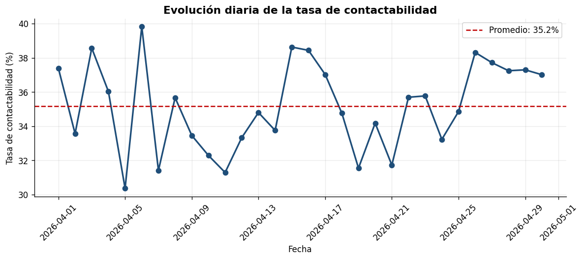
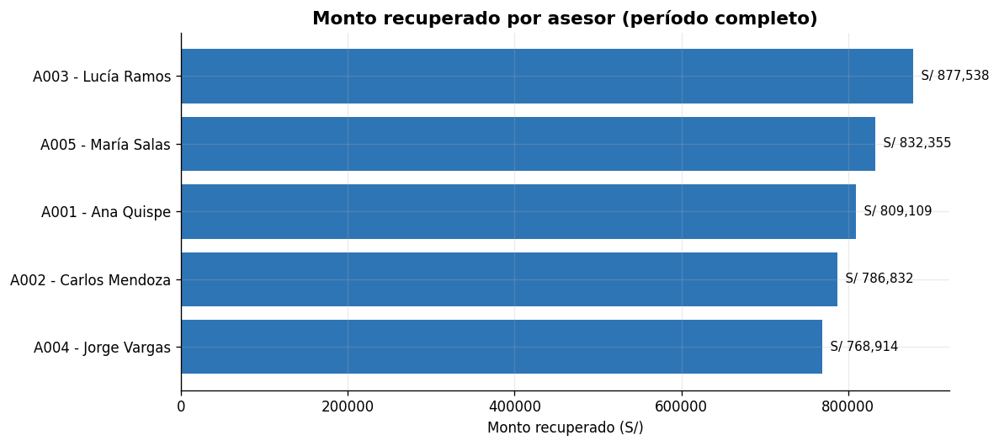
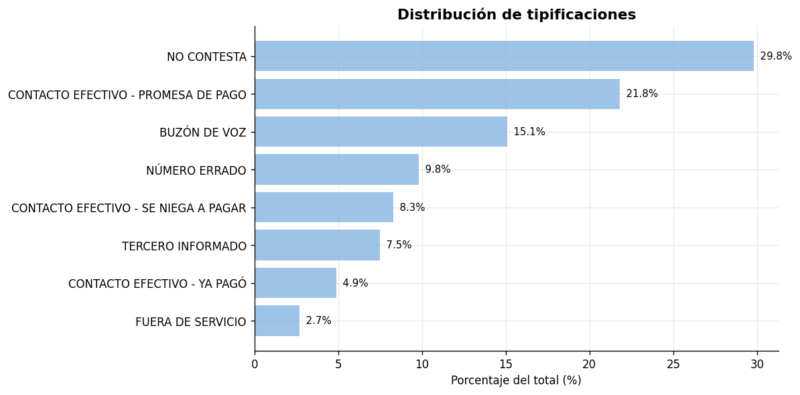
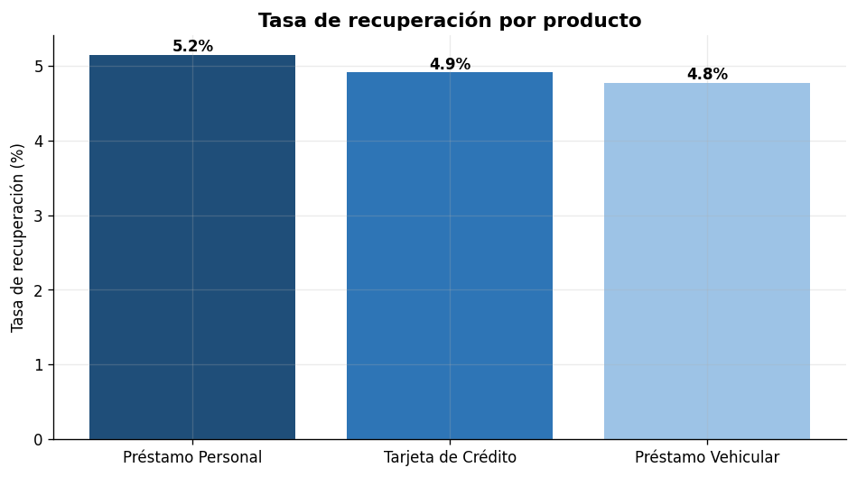

# Pipeline de Automatización de Reportes de Cobranza

> Proyecto de portafolio. Demuestra **identificación, diseño e implementación** de una solución de automatización end-to-end para un proceso típico del sector de cobranza telefónica.

[]()
[]()
[]()

---

## Problema de negocio

En una operación de cobranza telefónica, cada asesor genera un Excel diario con sus gestiones. Al fin de mes alguien debe consolidar **30 archivos × 5 asesores = 150 fuentes** con datos inconsistentes (DNIs con espacios, teléfonos con prefijos distintos, registros duplicados) para entregar el reporte ejecutivo.

**Esto toma típicamente entre 4 y 8 horas de trabajo manual repetitivo** y es candidato perfecto para automatización por su alto volumen, baja variabilidad y reglas claras.

## Solución implementada

Pipeline ETL en Python que:

1. **Extract** — lee automáticamente todos los Excel de la carpeta de entrada
2. **Transform** — limpia, normaliza, deduplica y valida 9 000+ registros
3. **Load** — genera un reporte Excel multi-hoja con KPIs ejecutivos
4. **Analyze** — produce 4 visualizaciones listas para presentación
5. **Audit** — registra cada ejecución en un log trazable

**Tiempo de ejecución: ~5 segundos vs. 4–8 horas manuales.** Eso es un ahorro estimado del 99 % en tiempo operativo y eliminación total del error humano de consolidación.

---

## Demo rápida

```bash
# 1. Clonar e instalar
git clone https://github.com/<tu-usuario>/walter-galindo-cobranza-pipeline.git
cd walter-galindo-cobranza-pipeline
pip install -r requirements.txt

# 2. Generar datos simulados (30 días de operación)
python src/generar_datos.py

# 3. Ejecutar pipeline completo
python src/pipeline.py

# 4. Generar gráficos
python src/generar_graficos.py

# 5. Correr tests
pytest tests/ -v
```

---

## Resultados de muestra

Sobre un dataset simulado de **9 129 gestiones** generadas a lo largo de un mes:

| KPI | Valor |
|---|---|
| Gestiones procesadas | 9 129 |
| Duplicados removidos | 250 (2.7%) |
| Tasa de contactabilidad | 35.1 % |
| Tasa de promesa de pago | 62.3 % |
| Monto total recuperado | S/ 4 074 746 |
| Tiempo de ejecución | < 5 segundos |

### Visualizaciones generadas






---

## Arquitectura

```
proyecto_python_cobranza/
├── src/
│   ├── generar_datos.py      # Genera 30 Excel simulados con datos sucios
│   ├── pipeline.py           # ETL principal: lectura, limpieza, KPIs, export
│   └── generar_graficos.py   # 4 visualizaciones para informe ejecutivo
├── tests/
│   └── test_limpieza.py      # 12 tests unitarios (pytest)
├── data/
│   ├── input/                # Archivos crudos (generados)
│   └── output/               # Reporte consolidado + logs
├── docs/
│   └── PDD.md                # Process Design Document
├── assets/                   # Gráficos generados
└── requirements.txt
```

---

## Stack técnico

| Capa | Herramienta | Por qué |
|---|---|---|
| Lenguaje | Python 3.10+ | Estándar de la industria para automatización de datos |
| Procesamiento | pandas | Manipulación tabular eficiente |
| I/O Excel | openpyxl | Lectura/escritura de .xlsx con formato |
| Visualización | matplotlib | Gráficos publicables sin dependencias pesadas |
| Testing | pytest | 12 tests unitarios cubriendo limpieza y KPIs |
| Logging | logging (stdlib) | Trazabilidad de cada ejecución |

---

## Principios de diseño aplicados

- **Reproducibilidad**: semilla fija (`random.seed(42)`) → cualquiera obtiene los mismos resultados
- **Idempotencia**: ejecutar el pipeline N veces produce el mismo output
- **Trazabilidad**: cada corrida queda registrada en `data/output/logs/`
- **Separación de responsabilidades**: extract / transform / load / visualize en módulos separados
- **Testabilidad**: funciones puras de normalización con cobertura unitaria

---

## Vinculación con metodologías Lean / Agile

| Principio | Aplicación en este proyecto |
|---|---|
| Eliminación de waste | El proceso manual de 4-8h es 100 % `waiting` y `over-processing` |
| Estandarización | Las funciones de normalización imponen formato único a DNIs y teléfonos |
| Poka-yoke | Validaciones que rechazan registros inválidos antes de propagar errores |
| Mejora continua | Logs permiten medir y optimizar tiempos de cada etapa |
| Sprints | Cada módulo se puede entregar y validar independientemente |

---

## Próximos pasos (roadmap)

- [ ] Empaquetar como CLI con `click`
- [ ] Integrar con Power BI vía conector ODBC
- [ ] Migrar lectura de Excel a base de datos SQL Server
- [ ] Schedulear con Power Automate Desktop
- [ ] Crear bot RPA en UiPath que descargue los Excel desde SharePoint

---

## Sobre el autor

**Walter Basilio Galindo Parra**
Bachiller en Ingeniería Química — UNI (Décimo Superior)
Experiencia en control de procesos, calidad y mejora continua.

[LinkedIn](https://linkedin.com/in/waltergalindo) · walter.galindo.p@uni.pe
